# Image Filtering & Edge Detection Techniques
<h1 style="text-align: center;"> Image Processing Techniques</h1>

In this Repository we present a variety of Image processing Techniques implemented from scratch using Numpy and Pure Python. Each Category of Algorithms is presented in its tab in the UI which we will discover next. 

## Implementations Added:

1. Noise Functions (Simulation of Different Noise Types): Uniform, Gaussian and Salt & Pepper.
2. Edge Detection Techniques:  Prewitt, Sobel and Roberts.
3. Image Histogram Equalization and Normalization.
4. Local and Global Thresholding 
5. Transformation to Gray Scale
6. Frequency Domain Filters: Low Pass and High Pass Filters

In addition to histogram and distribution curve drawing for the loaded image and the option to mix 2 input images.

## Results:

Our UI present a tab for each category of the implemented algorithms. We first load our image and apply the selected algorithm.

1. Noise Addition : 

   1. 1. Uniform Noise

         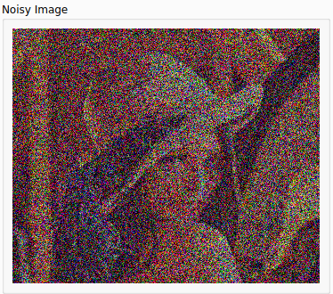

      2. Gaussian Noise

         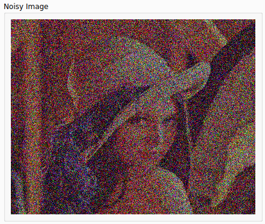

      3. Salt & Pepper

         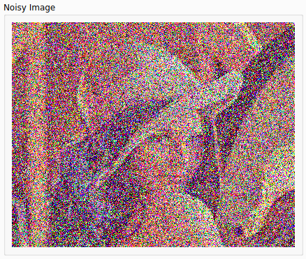

2. Noise Filtration: 

   1. Average Filter (Applied on Gaussian Noise)

      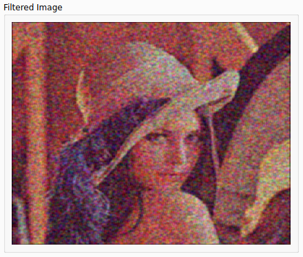

   2. Gaussian Filter (Applied on Gaussian Noise)

      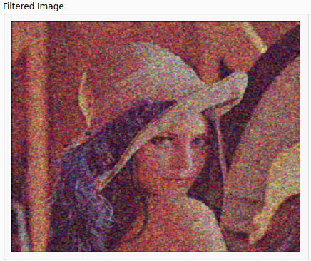

   3. Median Filter (Applied on a Salt & Pepper Noisy Image)

      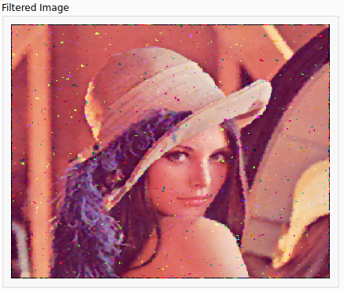

3. Edge Detection Techniques: 

   1. 1. Sobel

         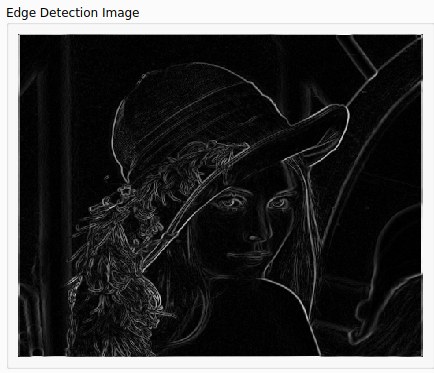

      2. Prewitt

         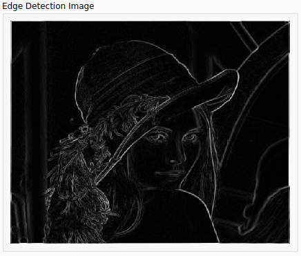

      3. Roberts

         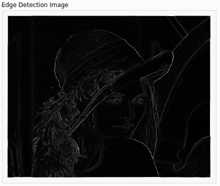

   You can apply different SNR ratios and choose the Sigma of Each Algorithm implemented from the sliders added on the left, each cell is marked with its contents and the application of the change in the sliders is instant.

   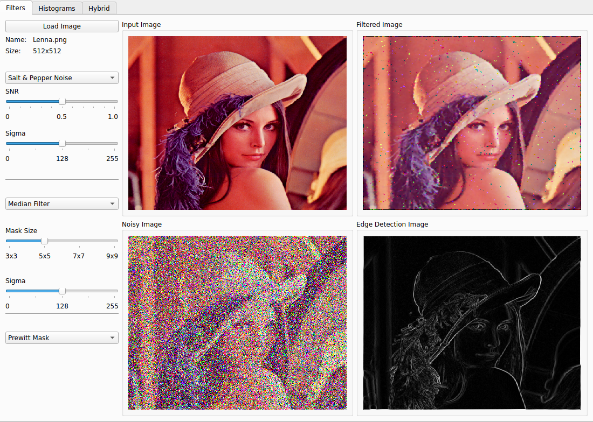

4. Histogram Equalization with input and output histograms

   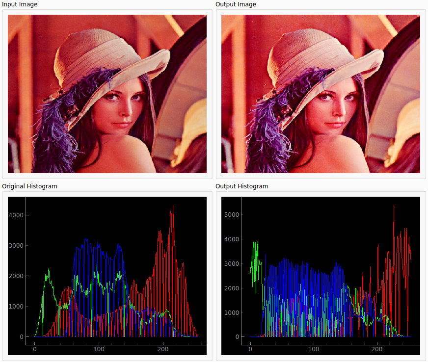

5. Local and Global Thresholding

   

   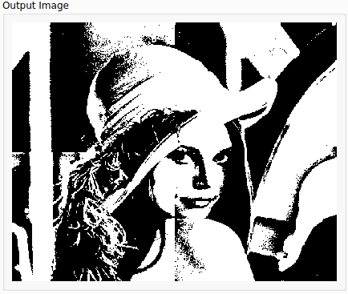

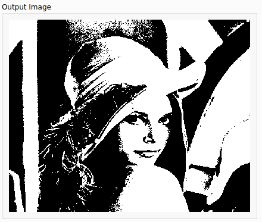

6. Gray Scale Transformation 

   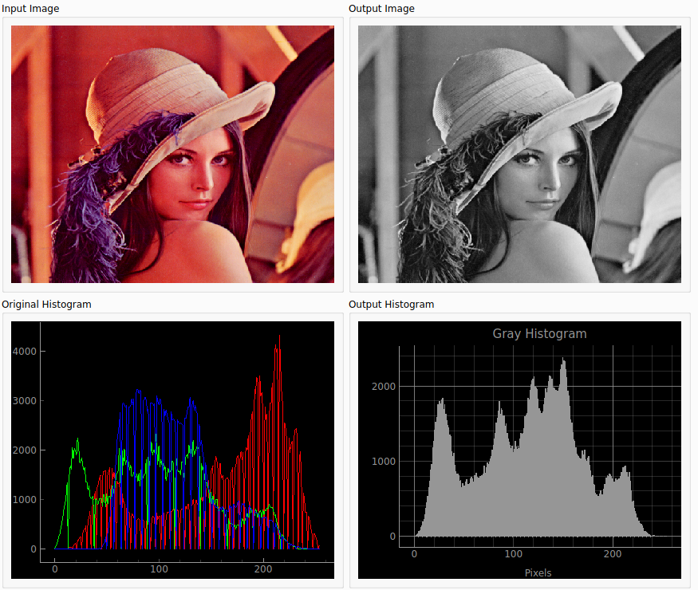

7. Frequency Domain Mixing 

   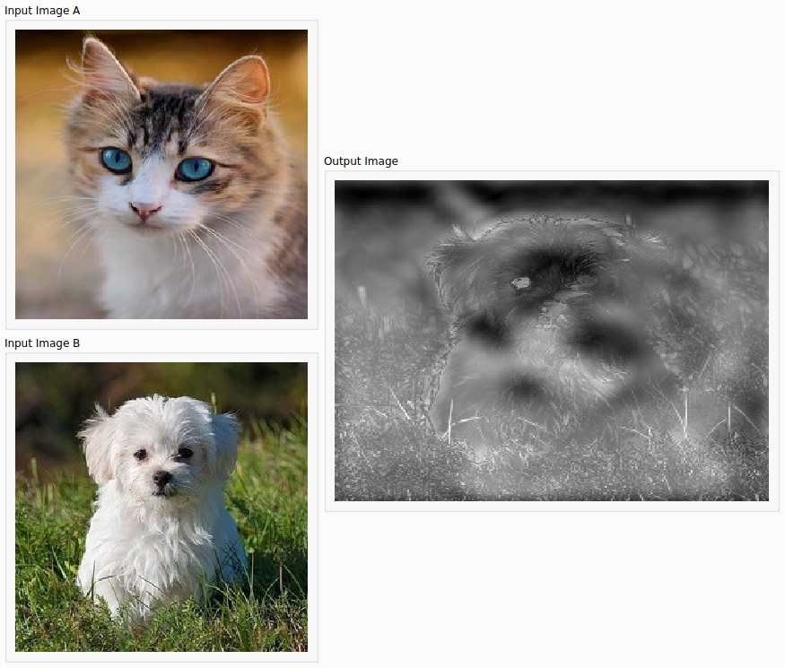